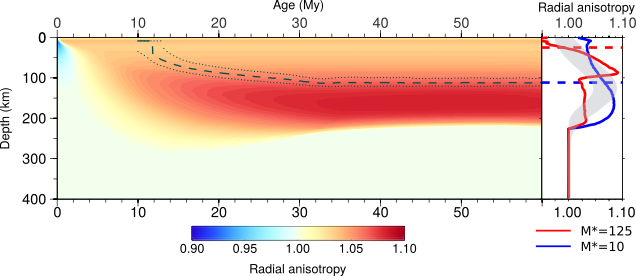

The existence of seismic anisotropy in the Earth's upper mantle was already proposed in the preliminary reference Earth model, and is now supported by many observations such as shear-wave splitting. It is tought to mainly arise from the crystallographic preferred orientation of olivine at large scale, developed during their plastic deformation in the convective mantle. As such, observations of seismic anisotropy, if correctly interpreted, can provide information on the upper mantle present and past deformation. I study the link between mantle flow and seismic anisotropy using the D-Rex model, that simulates the deformation of a peridotite polycrystal in the dislocation creep regime. The predicted anisotropy can be compared, for example, with global tomography models.

<figure>
  
 
    
    <figcaption>Radial anisotropy predicted for a plate-driven mid-ocean ridge flow. The model accounts for both diffusion and dislocation creep deformation mechanisms. </figcaption>
  

</figure>

