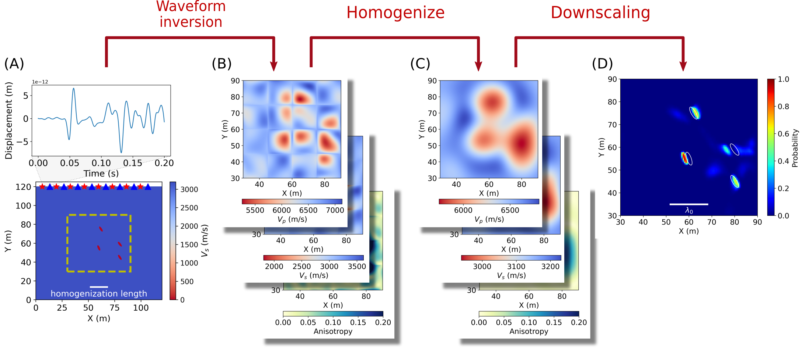
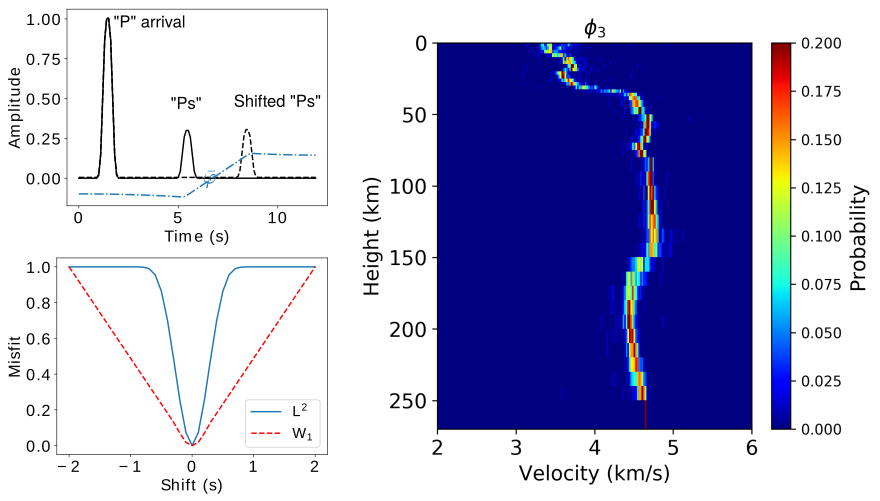

## Downscaling seismic tomography models

We study how the incorporation of homogenization theory, in particular the non-periodic elastic homogenization, can help for seismic imaging methods. In the case of full-waveform inversion, it allows to separate the problem in two steps:
(i) An homogenized FWI (HFWI), which differs from conventional FWI in the definition of the inverted model: it is fully anisotropic with a wavefield-adapted discretization, and it is homogenized after the last iteration (or, if required for helping convergence, after each iteration);
(ii) A downscaling step: we search for micro-scale models having an effective medium close to the HFWI solution.
An example applied to a cavity detection problem is displayd below.

<figure>
  
 
    
    <figcaption> Downscaling with inverse hmogenization : (A) True model and waveform data; (B) FWI resulting model; (C) homogenized resulting model; (D) Ensemble of compatible micro-scale models, represented as the probability of recovering void at each spatial point in the model. </figcaption>
  

</figure>

## Optimal transport for receiver function inversion

We propose to improve receiver function inversion by using a misfit function based on an optimal transport distance, instead of the conventional least-squares misfit, a strategy that has shown its assets in the context of full waveform inversion. This approach views a seismogram as a distribution of ‘mass’. The optimal transport distance between two waveforms is the minimal cost of transporting one waveform onto the other. The optimal transport distance reduces the number of local minima in the misfit function, which, in the case of a linearized inversion, significantly reduces the dependency to the starting model and results in a better convergence towards the solution model. We performed a joint inversion of the P-wave receiver function and surface wave dispersion curves at the Hyderabad station in India.

<figure>
  
 
    
    <figcaption> Use of optimal transport distance for receiver function inversion. On the left : comparison between the least-squares (L2) and the optimal transport (W1) misfit functions in the case of a synthetic receiver function. On the right: application to a 1-D inversion of P-RF at the Hyderabad station. </figcaption>
  

</figure>

## Development of seismic anisotropy in the upper mantle

The existence of seismic anisotropy in the Earth's upper mantle was already proposed in the preliminary reference Earth model, and is now supported by many observations such as shear-wave splitting. It is tought to mainly arise from the crystallographic preferred orientation of olivine at large scale, developed during their plastic deformation in the convective mantle. As such, observations of seismic anisotropy, if correctly interpreted, can provide information on the upper mantle present and past deformation. I study the link between mantle flow and seismic anisotropy using the D-Rex model, that simulates the deformation of a peridotite polycrystal in the dislocation creep regime. The predicted anisotropy can be compared, for example, with global tomography models.

<figure>
  
 
    
    <figcaption>Radial anisotropy predicted for a plate-driven mid-ocean ridge flow. The model accounts for both diffusion and dislocation creep deformation mechanisms. </figcaption>
  

</figure>

